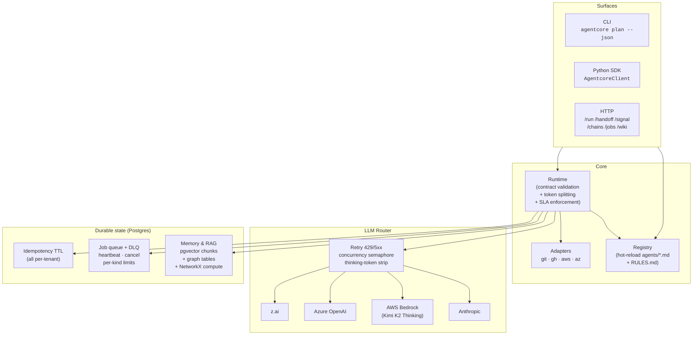
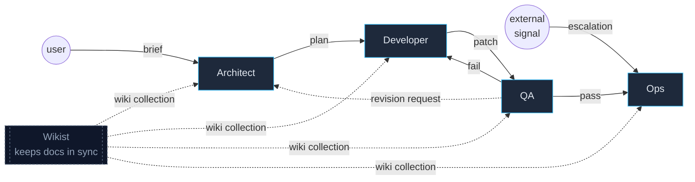
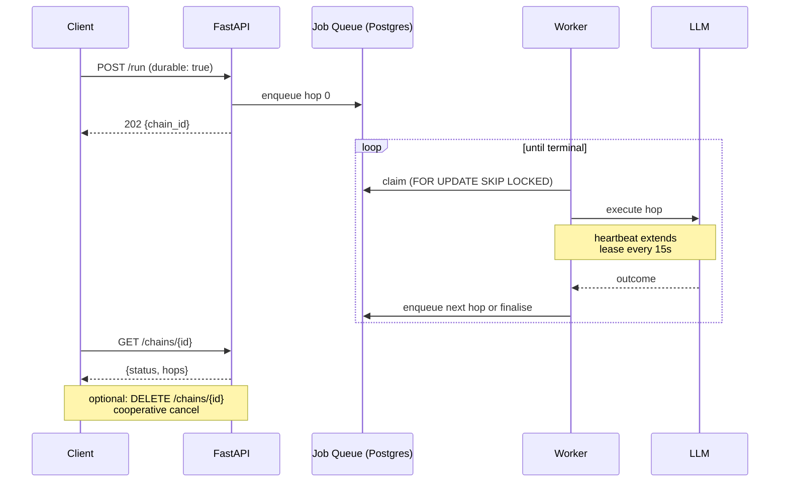

# agent-core-orchestrator

A hot-loadable, markdown-first, codebase-aware **role mesh** for SDLC agents.
Drop a folder of `*.agent.md` files into any project, hit one CLI command, and
get a contract-bound team of Architect / Developer / QA / Ops / Wikist
working together through a thin FastAPI orchestrator — universally, on any
codebase, on any OS.

> The wedge: every other framework either monoliths the team (MetaGPT) or
> ships a runtime without a role library (LangGraph, OpenAI Agents SDK).
> `agentcore` is the smallest thing that makes role definitions a first-class
> file format, with bounded contracts that compose with Copilot, Claude Code,
> Cursor, or nothing at all.

---

## Highlights

- **One file per role.** YAML frontmatter + system-prompt body. The same file
  works as a Claude Code subagent (`/agents`), an `AGENTS.md` entry for any
  IDE that reads it, and a fully-typed agentcore spec.
- **Bounded contracts.** Every handoff between roles is validated against the
  receiver's `inputs` / `outputs` schema before the LLM is ever called. No
  silent shape drift. List/dict element types are checked too.
- **Hot-reload.** Edit an `agent.md`; the registry swaps it in atomically. In-
  flight tasks are pinned to the version they started with.
- **Project-wide rules.** `RULES.md` at the repo root is mtime-cached and
  prepended to every agent's system prompt. Edit freely — changes land on
  the next hop without restarting the orchestrator.
- **Multi-provider LLM router.** Anthropic, AWS Bedrock (with Kimi K2
  Thinking), Azure OpenAI, z.ai. Per-agent provider/model in frontmatter,
  automatic fallback when the declared provider has no credentials, bounded
  retries on 429/5xx, thinking-token stripping for reasoning models.
- **Real token counting.** tiktoken (offline, bundled) → optional HF
  tokenizer JSON → chars/3 estimate. Used for context-budget splitting of
  large payloads into safe chunks.
- **Hybrid RAG.** Postgres stores pgvector code/doc chunks plus durable
  graph tables for agent/task/file/symbol memory. NetworkX is the in-
  process compute layer for Louvain/community detection and graphify
  subgraph ingestion. Code-symbol traversal is delegated to **graphify**
  (`graphifyy` Python package); its `impact()` returns are merged back
  into the operational graph after every agent hop with full provenance
  (`created_by` on every node and edge).
- **Living wiki.** Optional curator role (`agents/wikist.agent.md`) maintains
  a markdown wiki under `.agentcore/wiki/<project>/<branch>/`, indexed in
  pgvector under `wiki:<project>:<branch>` so every other agent retrieves
  wiki context at runtime. All collection names go through a single
  sanitiser (`wiki/naming.py`) so cross-tenant leaks are structurally
  impossible. Mirrors out to Claude Code skills, Copilot prompts, and
  Cursor rules.
- **Self-discovery QA.** QA inspects the developer's diffs, asks the LLM to
  propose test commands for the host OS, and runs each candidate in an
  isolated git worktree until one passes. No per-language heuristics, no
  config — works on any stack.
- **Durable chains.** `/run` with `durable: true` enqueues each hop as a
  Postgres job; mid-hop failures are reclaimed by the next worker via the
  jobs table's `locked_until` path. State survives orchestrator restarts.
  `DELETE /chains/{id}` cooperatively cancels in-flight chains.
- **Job queue with DLQ.** `FOR UPDATE SKIP LOCKED` claim pattern, per-kind
  concurrency caps (`AGENTCORE_WORKER_KIND_LIMITS`), heartbeat lease
  extension with owner check, dead-letter preservation for human review,
  and `POST /jobs/{id}/retry` to resurrect after a fix.
- **Idempotency keys.** `Idempotency-Key` header on `/run`, `/handoff`,
  `/signal`, `/wiki/refresh` collapses duplicate webhook deliveries to a
  single execution. Backed by a Postgres TTL store with in-memory fallback.
- **Multi-tenant.** `project_id` is a hard boundary on idempotency, jobs,
  graph state, and wiki collections. `X-Project-Id` header overrides the
  orchestrator's default `project_name` per request.
- **Schema migrations.** Alembic at `migrations/`; `agentcore migrate
  upgrade head` applies them. `verify_schema(strict=True)` runs in the app
  lifespan so boot fails loud with an actionable message instead of a
  cryptic error when migrations are pending. Inline `init_schema()` calls
  remain as a dev fallback.
- **SLA + chain timeout.** Per-agent `sla_seconds` is enforced via
  `asyncio.wait_for` around each LLM call. `AGENTCORE_MAX_CHAIN_SECONDS`
  caps the entire chain. Both are wall-clock budgets — no token clamping.
- **LLM concurrency bound.** `AGENTCORE_LLM_MAX_CONCURRENCY` semaphore in
  the router caps in-flight provider calls per process.
- **Host-credentialed integrations.** Optional GitHub / AWS / Azure adapters
  ride on the host's existing `gh` / `aws` / `az` CLIs — agentcore never
  asks for credentials.
- **Python SDK.** `from agentcore.client import AgentcoreClient` (or
  `AsyncAgentcoreClient`) — auto-attaches bearer token, project id, and
  can auto-generate idempotency keys.
- **CLI with `--json`.** `agentcore plan ... --json` emits a flat, jq-
  friendly object so CI pipelines can pipe through it without parsing
  rich output. Spinner on review rounds for interactive runs.
- **Cross-platform.** Linux, macOS, Windows. PowerShell-aware. Python 3.11–3.13.
- **Run anywhere.** Orchestrator on host or in Docker. Postgres+pgvector
  always in a container. Sandbox agent shell-outs in `host` or `docker` mode.
- **Devcontainer.** `.devcontainer/` mounts the workspace and starts the
  existing Postgres compose service so integration tests have a real DB.
- **Self-maintaining.** Optional triggers (webhooks, scheduled scans) feed
  Signals to Ops, which can escalate to Architect → Dev → QA autonomously.

---

## Quickstart

```bash
# 1. Bring up postgres+pgvector (or let agentcore do it)
uv run agentcore up postgres
# or:  docker compose up -d postgres

# 2. Install (with uv, recommended)
uv sync
cp .env.example .env
# fill in at least one provider key (e.g. ZAI_API_KEY or ANTHROPIC_API_KEY)

# 3. Apply schema migrations
uv run agentcore migrate upgrade head

# 4. Sanity check the host
uv run agentcore doctor

# 5. Index the current repo
uv run agentcore index .

# 6. Run the role mesh
uv run agentcore plan "Add a /metrics endpoint that exposes Prometheus counters"

# For CI / scripting:
uv run agentcore plan "..." --json | jq '.applied'
```

Without `uv`:

```bash
python -m venv .venv && source .venv/bin/activate     # macOS/Linux
# .venv\Scripts\Activate.ps1                          # Windows PowerShell
pip install -e .
agentcore doctor
```

---

## What an `agent.md` looks like

```markdown
---
name: architect
description: Plans technical design from a brief.
tools: [Read, Grep, Glob, WebSearch]
model: claude-opus-4-7

llm:
  provider: anthropic
  model: claude-opus-4-7
  temperature: 0.2

soul:
  role: architect
  voice: precise, terse, plan-oriented
  values: [correctness, simplicity, reversibility]

contract:
  inputs:
    - { name: brief, type: string, required: true }
  outputs:
    - { name: summary,         type: string,             required: true }
    - { name: files_to_change, type: "list[FileChange]", required: true }
  accepts_handoff_from: [user, ops, qa]
  delegates_to: [developer]
  sla_seconds: 1800

knowledge:
  rag_collections: [code, docs, wiki]
---

You are the Architect. Read the brief, study the relevant code via the
provided context bundle, and produce a TechnicalPlan…
```

The same file is consumable by Claude Code (it ignores the unknown frontmatter
keys and treats the body as the system prompt). Run `agentcore link claude` to
mirror it into `.claude/agents/`.

See [`docs/SPEC.md`](docs/SPEC.md) for the full spec, and `RULES.md` at the
repo root for project-wide rules prepended to every agent.

---

## Architecture



### Role mesh



### Durable chain lifecycle



---

## Endpoints

```
GET    /healthz              liveness + agent count
GET    /agents               registered specs
GET    /capabilities         host capability matrix (gh, aws, az)
POST   /run                  start a chain (sync) or enqueue durable
POST   /handoff              drive one explicit hop
POST   /signal               accept an external Signal
GET    /tasks/{id}/trace     full trace for a task
GET    /chains/{id}          status + result of a durable chain
DELETE /chains/{id}          cooperative cancel of a durable chain
GET    /jobs/dead-letter     list permanently-failed jobs
DELETE /jobs/dead-letter     purge dead-letter rows
POST   /jobs/{id}/retry      resurrect a dead-lettered job
```

Wiki endpoints (when `AGENTCORE_ENABLE_WIKI=true`):

```
GET  /wiki                 catalog
GET  /wiki/{path}          one page (markdown + frontmatter)
GET  /wiki/search?q=...    semantic search across the wiki collection
POST /wiki/refresh         enqueue seed/incremental/lint refresh
```

Mutating endpoints accept `Idempotency-Key` and `X-Project-Id` headers.
When `AGENTCORE_API_TOKEN` is set, mutating endpoints require
`Authorization: Bearer <token>`. When `AGENTCORE_HOST` is not
`127.0.0.1`/`localhost`, the token becomes required at startup.

---

## Python SDK

```python
from agentcore.client import AgentcoreClient

cli = AgentcoreClient(
    "http://localhost:8088",
    api_token="...",
    project_id="my-project",
    auto_idempotency=True,
)

# Sync chain
res = cli.run(
    to_agent="architect",
    payload={"brief": "add /metrics endpoint"},
    durable=False,
)
print(res["task_id"], res["hops"])

# Durable chain — poll for result
queued = cli.run(
    to_agent="architect",
    payload={"brief": "..."},
    durable=True,
)
status = cli.chain_status(queued["chain_id"])
```

Async flavour mirrors the same method set: `AsyncAgentcoreClient`.

---

## Multi-project & sandboxing

- **One orchestrator, many projects.** Pass `X-Project-Id: <name>` on every
  request; idempotency, jobs, graph state, and wiki collections partition
  automatically. Or point each project's `.env` at a different
  `AGENTCORE_AGENTS_DIR` and `PGDATABASE` and run separate orchestrators.
- **Sandbox modes.** `AGENTCORE_SANDBOX_MODE=host` (default) runs agent
  shell-outs on the orchestrator host. `=docker` wraps them in `docker exec`
  against `AGENTCORE_SANDBOX_IMAGE`. The orchestrator itself can run on host
  *or* in a container — independently.
- **QA isolation.** QA's self-discovered test commands run in a temp `git
  worktree` off the source repo — subprocess isolation, clean teardown, can't
  corrupt the live tree or the orchestrator's event loop.
- **Always-on infra.** `postgres` is the only service that *must* be
  containerised in dev. It hosts pgvector chunks, graph nodes/edges/
  communities/events, the idempotency cache, and the job queue.

---

## Optional integrations (host-credentialed)

agentcore never asks for cloud credentials. Each opt-in adapter rides on the
equivalent CLI already installed and authenticated on the host:

| Capability | CLI required        | Auth check                          | Enable                          |
| ---------- | ------------------- | ----------------------------------- | ------------------------------- |
| GitHub     | `gh`                | `gh auth status`                    | `AGENTCORE_ENABLE_GITHUB=true`  |
| AWS        | `aws`               | `aws sts get-caller-identity`       | `AGENTCORE_ENABLE_AWS=true`     |
| Azure      | `az`                | `az account show`                   | `AGENTCORE_ENABLE_AZURE=true`   |

`agentcore doctor` shows the live status matrix with OS-correct install hints.

When enabled, Ops can:

- triage open PRs, comment, and open remediation PRs (`gh`)
- listen for failing GitHub Actions runs
- read CloudWatch alarms / Azure Monitor alerts and escalate to Architect

---

## Code-graph integration

**graphify** is the in-process code knowledge feature; the Python dependency is
`graphifyy`. It uses native-Python tree-sitter + NetworkX, so subgraphs compose
with our NetworkX compute mirror without IPC, then persist through Postgres
graph tables.

The enrichment loop (every agent hop):

```
agent emits {files_to_change | diffs}
        │
        ▼
runtime extracts paths
        │
        ▼
graphify.impact(path)  ──►  SymbolImpact(symbol, downstream)
        │
        ▼
KnowledgeGraph
   .record_change(task, file, created_by=agent)
   .record_impact(task, file, downstream, created_by=agent)
   .merge_subgraph(graphify.subgraph_for([symbol, *downstream]))
```

After enough tasks, `agent:Architect` ↔ `task:T*` ↔ `file:src/auth/**` ↔
`symbol:OAuth.*` form a Louvain community — the team's institutional memory
of "this is the auth area". Every edge and node records which agent created
it (`created_by`) plus `first_seen`/`last_seen` for time-series reasoning.
The durable source of truth is Postgres; NetworkX is the local compute
layer for traversals and community detection.

---

## Composing with Copilot / Claude Code / Cursor

- `agentcore link claude` — mirrors the role library into `.claude/agents/`.
- `agentcore link claude --with-hooks` — also writes `.claude/settings.json`
  hooks that POST tool-use events to the orchestrator's `/signal`.
- `agentcore wiki link claude|copilot|cursor|all` — projects the wiki into
  each tool's conventions (`.claude/skills/`, `.github/prompts/`,
  `.cursor/rules/wiki.md`) so external IDEs see the same ground truth agents
  do.
- `agentcore wiki install-hook` — git post-commit hook that POSTs changed
  paths to `/wiki/refresh`. Cross-platform (Python, not bash).
- For Copilot / Cursor: the same `agent.md` files are picked up if they read
  `AGENTS.md`-style roles. The unknown frontmatter is ignored.

---

## What it's used for

Some shapes the codebase fits. None of these are configured by default —
each is just a particular wiring of the existing primitives.

- **Internal SDLC automation.** Architect/Developer/QA/Ops chain triggered
  by `agentcore plan ...` or webhooks. Wiki keeps module docs in sync.
- **Incident response.** Ops consumes Signals from CloudWatch / GitHub
  workflow failures, decides between acknowledge and escalate-to-Architect.
  Idempotency stops duplicate alerts from re-paging.
- **Codebase knowledge management.** Curator-maintained wiki, mirrored to
  Claude/Copilot/Cursor surfaces. Agents read from it on every loop, so
  the team's docs and the team's AI share one source of truth.
- **Multi-project platform.** One orchestrator, N projects via
  `X-Project-Id`. Idempotency, jobs, graph state, and wiki partition per
  project; `agents/` directory and `wiki_root` can also be per-project via
  env overrides.
- **Long-running autonomous loops.** `/run` with `durable: true` enqueues
  each hop as a job; orchestrator restarts mid-hop are reclaimed by the
  next worker. `DELETE /chains/{id}` cooperatively stops them.
- **Open-source maintenance.** GitHub adapter watches issues/PRs, Architect
  drafts triage, Developer drafts patches, QA self-discovers the test suite
  and runs it, Ops opens the PR.
- **Polyglot codebase agent.** Graphify covers Python/TS/Go/Rust/Java/C++
  etc; the five shipped roles are language-agnostic; QA's self-discovery
  finds whatever test runner the project already uses.

What it isn't a fit for: real-time / sub-second latency, single-shot
prompting (curl + jq is fine), or pure data-pipeline ETL where the LLM
is overhead (use Dagster/Airflow).

---

## License

Apache-2.0.
